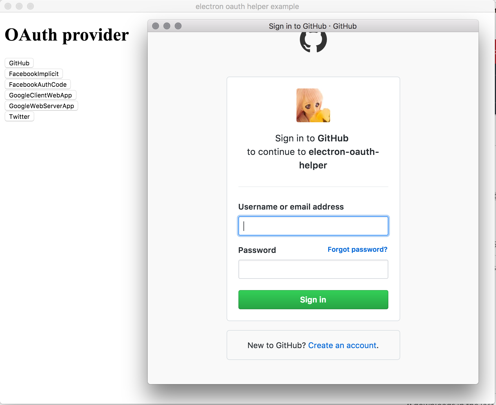

# Electron OAuth Helper

## What's this

Easy to use helper library for OAuth1 and OAuth2.

This automatically manages the Electron window for OAuth.

You can get a token just by calling a method of start OAuth.

## Install

`npm run electron-oauth-helper --save`

## Usage

### OAuth1

```js

const { OAuth1Provider } = require("electron-oauth-helper")

const config = { /* oauth config. please see example/main/config.example.js.  */}
const provider = new OAuth1Provider(config)
provider.perform()
  .then(token => {
    console.log(token)
  })
  .catch(error => console.error(error))
```

### OAuth2

```js

const { OAuth2Provider } = require("electron-oauth-helper")

const config = { /* oauth config. please see example/main/config.example.js.  */}
const provider = new OAuth2Provider(config)
provider.perform()
  .then(token => {
    console.log(token)
  })
  .catch(error => console.error(error))
```

## Example

example electron app => `example/`

